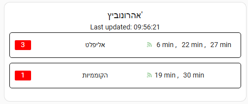

# Bus card for home assistant - Israel
show real time bus and train information

If you like my hard work and want to help with server cost, consider buying me a coffee :)<br>
<a href="https://www.buymeacoffee.com/silentbil" target="_blank"></a>


## Demo





## HACS Installation (Preferred option with updates)

<a href="https://my.home-assistant.io/redirect/hacs_repository/?owner=silentbil&repository=silent-bus&category=plugin" target="_blank"></a>

## HACS manual Installation 
 - In the HACS Frontend, click the 3 dots in the upper right
 - Click 'Add Custom Repository'
 - Fill in the repo url https://github.com/silentbil/silent-bus and choose 'Lovelace' category.
 - Install the custom card (should now appear in the Frontend)
 - HACS should automatically add the following to your resources:
```
url: /hacsfiles/silent-bus/silent-bus.js
type: Javascript Module
```

## Adding the Card to the Dashboard
Add a Manual card to the dashboard and enter the YAML to configure it as desired.

### Options - bus
| Name | Description | Default | Required |  Values |
| --- | --- | --- | --- | --- |
| `station` | station number | None | Yes  | number |
| `busLines` | bus lines | None | Yes | Array of numbers |

### Options - train
| Name | Description | Default | Required |  Values |
| --- | --- | --- | --- | --- |
| `fromStation` | station number | None | Yes  | number |
| `toStation` | station number | None | Yes  | number |
| `isTrain` | train card | false | Yes  | boolean |

## Find your station number - train
** Important**: Train stations have changed</br>
* Go to: [https://xn--4dbclabp0e.co.il/searchStations](https://github.com/silentbil/silent-bus/blob/main/train-stations) and search for your station
Usually it will start with 17***, For example: "Tel Aviv Hashalom" = 17046

## Find your station number - bus

* Go to: https://xn--4dbclabp0e.co.il/searchStations and search for your station
* Copy your station number


## Example - train

```
type: custom:silent-bus
isTrain: true
fromStation: 3600
toStation: 3700
```

## Examples - bus

```
type: custom:silent-bus
station: 24068
busLines:
  - 249
  - 40
  - 605
```

## Examples - light train (kala)

```
type: custom:silent-bus
station: 20719
busLines:
  - 1
  - 3
```
